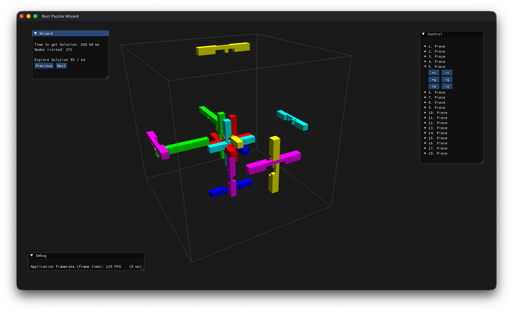

# Burr Puzzle Wizard

A C++ solver and OpenGL-based 3D viewer for [burr puzzles](https://en.wikipedia.org/wiki/Burr_puzzle) that voxelizes each
piece into a bitset and searches the puzzle's state space to recover the disassembly sequence.

Each puzzle is modeled on a discrete `N×N×N` voxel grid, and every piece is encoded as a `std::bitset`. Because the
geometry lives in bitsets, collision detection between pieces (the core operation of the solver) reduces to cheap
bitwise `AND`, `OR`, and `XOR` operations: two pieces overlap exactly when the `AND` of their bitsets is non-empty, and
moving a piece is just a bit shift. The solver explores the puzzle's state space with a priority-queue search,
grouping pieces that must move together into strongly connected components, until enough pieces have been freed for the
puzzle to fall apart. The resulting solution can then be stepped through, move by move, in the 3D viewer.

This project is a from-scratch rewrite of my master's thesis on solving burr puzzles.



## How it works

- **Bitset representation**: A piece occupying an `N×N×N` grid is a `std::bitset<N*N*N>`. Translating a piece is a left
  shift, and a move collides with the rest of the assembly when the bitwise AND of the piece and the occupied field is
  non-empty.
- **State-space search**: Each arrangement of pieces is a `Node`. The solver runs a best-first search (a priority queue
  ordered by a heuristic that rewards pieces being moved toward an exit) over these nodes, recording parents so the path
  back from a solved state can be reconstructed.
- **Strongly connected components**: When a piece is pushed in a direction it may shove neighboring pieces. Those
  forced-together pieces are grouped into strongly connected components (via a Kosaraju-style two-pass DFS) and moved as a
  single unit, which keeps the branching factor manageable.
- **Solved state**: A puzzle is considered solved once all but two of its pieces have been separated from the assembly.

## Building

The project builds on Linux, macOS, and Windows. A C++20-capable compiler and CMake ≥ 3.22 are required.

### Linux

Install the development packages for SDL2, GLEW, and OpenGL using the distribution's package manager:

```sh
# Debian / Ubuntu
sudo apt install build-essential cmake libsdl2-dev libglew-dev libgl1-mesa-dev

# Fedora
sudo dnf install gcc-c++ cmake SDL2-devel glew-devel mesa-libGL-devel

# Arch
sudo pacman -S base-devel cmake sdl2 glew
```

Then configure and build:

```sh
cmake -B cmake-build-release -DCMAKE_BUILD_TYPE=Release
cmake --build cmake-build-release
```

### macOS

Dependencies are resolved through `find_package`, so install them first (e.g. with Homebrew):

```sh
brew install sdl2 glew cmake
```

Then configure and build:

```sh
cmake -B cmake-build-release -DCMAKE_BUILD_TYPE=Release
cmake --build cmake-build-release
```

### Windows

The required SDL2 and GLEW libraries are bundled under `lib/` and the Windows headers under `include_windows/`, so no
extra setup is needed. Configure and build with the preferred generator:

```sh
cmake -B cmake-build-release
cmake --build cmake-build-release --config Release
```

The build copies `SDL2.dll` next to the executable automatically.

The resulting `burr_puzzle_wizard` binary is written to the `bin/` directory.

## Running

Launch the built executable from `bin/`. The puzzle to solve is selected in `src/main.cpp`:

```cpp
app.init_wizard(puzzle_18);
app.run();
```

Bundled puzzle definitions live under `src/puzzles/` (e.g. `puzzle_6`, `puzzle_18`). Each is a string literal listing
the unit-cube coordinates of every piece together with its initial position in the assembly.

### Controls

- **Wizard panel**: shows the solve time, number of nodes visited, and a **Previous / Next** stepper to walk through the
  computed solution one move at a time.
- **Control panel**: manually nudges individual pieces along the `±x`, `±y`, and `±z` axes.
- Drag to orbit the camera around the puzzle.
